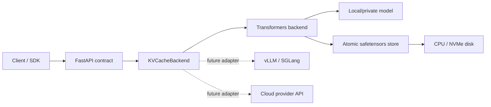

# KV Cache Service

一套面向本地或私有化大模型的 KV Cache 持久化服务。它把超长公共前缀分块执行
prefill，将每层 Key/Value 张量安全落盘，并在后续请求中跳过公共前缀计算，直接从缓存
继续推理。

当前版本是可运行的单机参考实现，同时保留了 backend 插件边界。生产环境中需要高并发、
多 GPU、分层存储或自动前缀匹配时，建议使用仓库内给出的 vLLM + LMCache 方案。

## 先说结论

这个目标可以实现，但有几个不能绕过的边界：

- 原始 KV 只能在**完全相同的模型权重、revision、tokenizer、dtype 和兼容 cache layout**
  上复用。它不是跨模型通用的“文本向量”。
- 分块 prefill 可以降低单次 prefill 的峰值计算压力，却不能突破模型的位置编码/context
  window。文本超过模型上限时，应换长上下文模型，或先做 RAG/分段摘要。
- 多数公有云 API 不提供原始 KV 张量的上传/下载能力。它们的 prompt caching 通常由服务商
  自动管理，只能复用相同前缀，不能把本项目生成的 KV 注入云端。
- KV 很大。理论大小约为
  `2 × 层数 × KV heads × head_dim × token 数 × 每元素字节数 × batch`。
  例如一个 28 层、4 个 KV heads、head_dim=128 的 GQA 模型，在 FP16 下约为
  56 KiB/token，128K tokens 约 7 GiB（未计元数据和运行时开销）。

因此推荐的分层选择是：

| 场景 | 推荐实现 | 适用性 |
|---|---|---|
| 功能验证、单机低并发、需要显式 cache ID | 本仓库 Transformers backend | 已实现 |
| 私有化生产、多 GPU、高并发、磁盘/CPU 分层 | vLLM + LMCache | 见 `deploy/` |
| 公有云模型 API | 实现自定义 backend，映射服务商的 prompt-cache 语义 | 已预留接口 |

## 架构



`KVCacheBackend` 是稳定扩展点。HTTP 层不依赖 Transformers；后续可以换成远端私有推理
服务、对象存储、LMCache 控制面或某个云厂商的逻辑缓存句柄。

## 快速开始

建议使用 Python 3.11 或 3.12。Transformers 参考 backend 的安装方式：

```bash
python -m venv .venv
source .venv/bin/activate
pip install -e '.[local]'
cp .env.example .env
set -a
source .env
set +a
kvcache-server
```

默认模型是体积较小的 `Qwen/Qwen2.5-0.5B-Instruct`。首次启动实际构建缓存时会从
Hugging Face 下载模型；私有环境可把 `KVCACHE_MODEL` 指向本地模型目录，并设置
`KVCACHE_LOCAL_FILES_ONLY=true`。

### 1. 分块解析并存储公共前缀

```bash
curl -X POST http://localhost:8080/v1/kv-caches \
  -H 'Content-Type: application/json' \
  -d '{
    "text": "这里放会被多个请求复用的长文档或系统前缀。\n\n",
    "chunk_size": 512
  }'
```

响应中的 `cache_id` 由模型指纹和 token 序列共同决定。相同输入再次构建会直接命中现有
缓存，不会重复 prefill。

### 2. 直接复用已处理的 KV Cache

```bash
curl -X POST http://localhost:8080/v1/completions \
  -H 'Content-Type: application/json' \
  -d '{
    "kv_cache_id": "<上一步的 cache_id>",
    "prompt": "请概括上面的内容。",
    "max_tokens": 128,
    "temperature": 0
  }'
```

`usage.cached_tokens` 是跳过 prefill 的前缀 token 数。也可不传 `kv_cache_id`，此时接口
退化成普通 completion。

对 token 边界有严格要求时，构建和调用都传 `input_ids`。分别 tokenizer.encode
`prefix` 与 `suffix` 可能和一次性编码 `prefix + suffix` 不完全相同，尤其是前缀没有以空格、
换行或模板边界结尾时。

## API

| 方法 | 路径 | 用途 |
|---|---|---|
| `GET` | `/health` | 存活状态；不会主动加载模型权重 |
| `GET` | `/v1/models` | OpenAI 风格模型列表 |
| `POST` | `/v1/kv-caches` | 分块 prefill 并持久化 |
| `GET` | `/v1/kv-caches` | 列出缓存 |
| `GET` | `/v1/kv-caches/{id}` | 读取元数据 |
| `DELETE` | `/v1/kv-caches/{id}` | 删除缓存 |
| `POST` | `/v1/completions` | 普通生成或从缓存继续生成 |

服务启动后可访问 `http://localhost:8080/docs` 查看交互式 OpenAPI 文档。

## 持久化格式与一致性

每个缓存目录包含：

```text
data/kv-cache/<cache_id>/
├── metadata.json
└── tensors.safetensors
```

- `safetensors` 避免反序列化任意 Python 对象。
- 临时目录写完后原子发布，避免请求读到半成品。
- 加载时默认校验 tensor 文件 SHA-256。
- metadata 保存模型指纹、前缀 token hash、层数、dtype 和体积。
- tensor 文件包含每层 K/V、精确 prefix token IDs，以及“前缀结束后下一 token”的 logits，
  因而即使 suffix 为空也能继续生成。

KV 和 token IDs 都应按原始提示词同等级别保护。目录不应放在公开对象存储中，也不应跨
租户共享；生产环境应补充磁盘加密、租户 namespace、访问控制和 TTL/LRU 淘汰。

## 配置

主要环境变量见 [`.env.example`](.env.example)：

- `KVCACHE_MODEL`：Hugging Face 模型 ID 或本地目录。
- `KVCACHE_DEVICE`：`auto`、`cpu`、`cuda`、`mps` 等。
- `KVCACHE_DTYPE`：`auto`、`float16`、`bfloat16`、`float32` 等。
- `KVCACHE_STORE_DIR`：缓存根目录。
- `KVCACHE_MAX_CONTEXT_TOKENS`：显式覆盖模型 context window；`0` 表示从 config 读取。
- `KVCACHE_BACKEND`：`transformers` 或 `python.module:factory`。

当前 Transformers backend 有意限制为 batch=1、decoder-only、完整 Dynamic/legacy K/V
layout，并用进程内锁串行访问单个模型。滑动窗口、hybrid attention、Mamba/线性 attention、
tensor parallel 和高并发应走 vLLM/LMCache，而不是扩张这个参考实现。

## 接入新的私有或云端 API

实现 `src/kvcache_service/backend.py` 中的 `KVCacheBackend`，并暴露一个接收 `Settings`、
返回 backend 实例的工厂：

```bash
export KVCACHE_BACKEND=examples.custom_backend:create_backend
kvcache-server
```

完整骨架见 [`examples/custom_backend.py`](examples/custom_backend.py) 和
[`docs/backend-extension.md`](docs/backend-extension.md)。API 路由无需修改。

## 生产化路径

高并发部署不要让应用手动传递巨大的 K/V 文件。vLLM 的 Automatic Prefix Caching 可对
重复 token block 自动命中；LMCache 则把这些 block 扩展到 GPU、CPU、NVMe 或远端分层
存储，并通过 vLLM 的 OpenAI-compatible API 对外服务。配置和命令见
[`deploy/README.md`](deploy/README.md)。

相关官方资料：

- [Transformers cache strategies](https://huggingface.co/docs/transformers/kv_cache)
- [vLLM automatic prefix caching](https://docs.vllm.ai/en/latest/features/automatic_prefix_caching/)
- [LMCache architecture](https://docs.lmcache.ai/developer_guide/architecture.html)
- [LMCache local storage](https://docs.lmcache.ai/kv_cache/storage_backends/local_storage.html)

## 测试

测试使用伪 causal LM，不下载任何模型，但覆盖了真实 tensor 的分块 prefill、safetensors
落盘、重载和缓存续推：

```bash
pip install -e '.[dev]'
pytest
```
